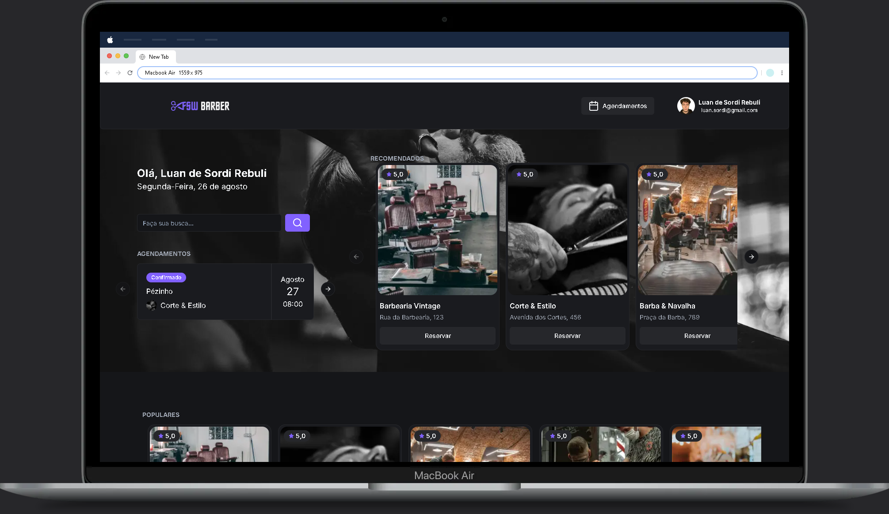

<h1 align="center">Full Stack Week Project - Barbearia</h1>

<h3 align="center">
  Agende conosco!
</h3>

## 🏠 About the project

Este projeto foi desenvolvido durante a Full Stack Week da Full Stack Club. Ele simula um sistema de agendamento para uma barbearia, incluindo:

Pesquisa de barbearias e serviços
Sistema de login com Google
Responsividade para desktops e mobiles
 

## 🖥️ Technologies

[TypeScript]  
[React.Js]  
[TailWindCSS]  
[Next.Js]  
[ShadCn]  
[Next-Auth]  
[Date-FNS]  
[Prisma]  
[PostgresSQL]  

## Run Project in you Navigator

https://fsw-barber-phi.vercel.app/

## Contributors

We thank the following people who contributed to this project:

<table>
  <tr>
    <td align="center">
      <a href="#">
         
        
          <b>Luan Rebuli</b>
        
      </a>
    </td>
  </tr>

## Certificates

https://app.rocketseat.com.br/certificates/3d261164-b7f5-4773-8414-72b172ad6f3c

</table>
